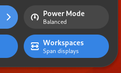
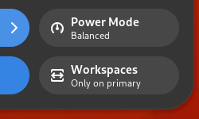

# Toggle workspace span

GNOME Shell extension to show a button on the panel or quick settings menu which toggles between the settings "Workspaces on primary display only" and "Workspaces span displays".

## Screenshots

 


## Installation

- This extension supports GNOME Shell versions 45-46. See other branches for older GNOME Shell versions.

**From GNOME Extensions Website**

https://extensions.gnome.org/extension/5482/toggle-workspace-span/

**Manual**

```bash
git clone https://github.com/arngo/gnome-shell-extension-toggle-workspace-span.git
cd gnome-shell-extension-toggle-workspace-span
cp -r toggle-workspace-span@arngo.github.com ~/.local/share/gnome-shell/extensions/
```

**Uninstall**

```bash
rm -rf ~/.local/share/gnome-shell/extensions/toggle-workspace-span@arngo.github.com
```
